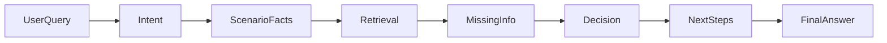

# PolicyOps Agent

A beginner-friendly portfolio project that started as a **Policy RAG Assistant** over public AI governance PDFs and is now being extended into an **agentic policy decision assistant** called **PolicyOps Agent**.

## What This Project Does

This project demonstrates how to build a grounded workplace policy assistant in stages:

1. **RAG foundation** - ingest documents, chunk text, embed meaning, store vectors, retrieve evidence, and generate cited answers.
2. **PolicyOps Agent foundation** - classify intent, extract scenario facts, retrieve policy sections, check missing information, make a conservative decision, and show a visual workflow trace.

The app can run in two modes:

- **RAG Mode (default)** - original NIST / OWASP policy Q&A
- **Agent Mode** - Acme Corp mock workplace policy scenarios with traceable workflow steps

## Why Policy Documents Are Needed

A language model can answer many general questions from training data, but that is not enough for policy assistance.

| Approach | What it uses | Strength | Risk |
|----------|--------------|----------|------|
| **LLM general knowledge** | Training data | Fast, broad | May invent rules |
| **RAG grounded answers** | Retrieved source documents | Verifiable citations | Depends on retrieval quality |
| **Agentic workflow** | State + tools + retrieval + trace | Structured, debuggable decisions | More engineering complexity |

PolicyOps Agent is designed to move from "chatbot answer" toward "traceable policy workflow."

## Mock Policy Corpus

The **Acme Corp** policies in `data/policies/mock/` are **fictional** and created for demo purposes only.

They help the system answer realistic workplace questions about:

- travel and expenses
- reimbursement
- gifts and hospitality
- remote work
- approvals
- data access

**Important:** These documents are not legal, HR, finance, or compliance advice.

See [data/policies/source_references.md](data/policies/source_references.md) for the synthetic data disclaimer.

## Folder Structure

```text
policy-rag-assistant/
??? app/                     # Streamlit UI
??? src/                     # RAG pipeline (ingest, chunk, embed, retrieve, generate, evaluate)
??? agent/                   # PolicyOps Agent workflow (state, tools, nodes, graph, trace)
??? data/
?   ??? raw/                 # NIST / OWASP PDFs
?   ??? policies/mock/       # Synthetic Acme Corp markdown policies
??? scripts/                 # Utility scripts such as mock policy ingestion
??? evals/                   # Gold questions and evaluation outputs
??? reports/                 # Architecture and evaluation reports
```

## Phase 0: Mock Policy Data

### What was built

- Six synthetic Acme Corp markdown policy files with stable section IDs
- A source references / disclaimer file
- Section-aware markdown ingestion for the existing Chroma index
- An additive ingest script that does not wipe the NIST index

### Why it matters

The agent needs realistic company policy text to retrieve from. Without source documents, the system would have to guess.

### Files created

- `data/policies/mock/acme_travel_expense_policy.md`
- `data/policies/mock/acme_reimbursement_policy.md`
- `data/policies/mock/acme_gifts_hospitality_policy.md`
- `data/policies/mock/acme_remote_work_policy.md`
- `data/policies/mock/acme_approval_matrix.md`
- `data/policies/mock/acme_data_access_policy.md`
- `data/policies/source_references.md`
- `src/ingest_policies.py`
- `scripts/ingest_mock_policies.py`

### How to ingest mock policies

```bash
python -m src.embed --rebuild
python scripts/ingest_mock_policies.py
```

The first command builds the NIST baseline index. The second command **adds** Acme Corp policy chunks to the same Chroma collection.

### How to test retrieval

After ingestion, try questions such as:

- `client dinner reimbursement 18000 INR`
- `accept gift from vendor 12000`
- `share customer data with external vendor`

## Phase 1: Agent Foundation

### What was built

- A new `agent/` package with state, trace, tools, nodes, graph, and prompt placeholders
- A linear workflow runner: `run_policy_agent(user_query)`
- Rules-based Phase 1 tools for intent, scenario parsing, retrieval, missing info, decision, and next steps
- An **Agent Mode** toggle in Streamlit

### Why it matters

This creates the technical foundation for a portfolio-ready agentic system without jumping straight to LangGraph, memory, or multi-agent orchestration.

### Files created

- `agent/__init__.py`
- `agent/state.py`
- `agent/trace.py`
- `agent/tools.py`
- `agent/nodes.py`
- `agent/graph.py`
- `agent/prompts.py`

### Files modified

- `app/streamlit_app.py`
- `src/config.py` (added `MOCK_POLICY_DIR`)

### How the agent workflow runs

```text
User question
-> classify intent
-> parse scenario facts
-> retrieve policy chunks
-> check missing information
-> make basic decision
-> generate next steps
-> format final answer
-> display trace and state in the UI
```

### What the state object means

`AgentState` is the shared memory of one agent run. It stores the user query, extracted facts, retrieved chunks, missing info, decision, next steps, final answer, and trace.

### What the trace means

The trace is a beginner-friendly activity log of workflow steps. It shows what happened, not private chain-of-thought reasoning.

### How to test Agent Mode

```bash
streamlit run app/streamlit_app.py
```

Turn on **Agent Mode** in the sidebar and ask an Acme Corp scenario question.

## Phase 1 UI Improvements

The Streamlit app was redesigned to feel more like an **enterprise AI workbench** for portfolio demos.

### What changed in the UI

- Added a stronger product header with title, subtitle, and phase badge
- Introduced a welcome card with sample questions before the first chat
- Redesigned the decision area into prominent metric cards
- Displayed the final answer in a scannable card with clear sections
- Replaced plain source lists with source cards (file, section, score, excerpt)
- Rendered the agent trace as a workflow timeline
- Moved raw JSON state into a collapsed **Developer Debug View**
- Improved the sidebar into a control panel with clickable example questions

### Why these UI elements matter

| UI element | Why it helps |
|------------|--------------|
| **Decision cards** | Business viewers can quickly see intent, decision, risk, and confidence |
| **Source cards** | Makes grounded retrieval visible and easier to trust |
| **Agent trace** | Shows the workflow steps without exposing chain-of-thought |
| **Developer debug view** | Lets technical reviewers inspect state while keeping the main UI clean |

### Workflow diagram



Text pipeline shown in the app:

```text
User Query -> Intent -> Scenario Facts -> Retrieval -> Missing Info -> Decision -> Citation Verify -> Clarifying Q -> Next Steps -> Final Answer
```

## Phase 2: Grounded Decision Engine

### What changed

Phase 2 upgrades the PolicyOps Agent from a basic linear workflow to a **grounded decision engine**:

- **Structured schemas** (`agent/schemas.py`) document scenario facts, retrieved chunks, and policy decisions
- **Policy-area decision rules** (`agent/decision_rules.py`) apply conservative reimbursement, gift, remote work, data access, and travel rules
- **Citation verification** (`agent/citation_verifier.py`) only cites chunks that were actually retrieved
- **Clarifying questions** when important scenario details are missing
- **Structured final answers** (`agent/answer_formatter.py`) with rationale, approvals, verified citations, and disclaimer
- **Lightweight tests** (`tests/test_phase2_agent.py`) using `unittest` and mocked retrieval

### Beginner explanations

| Concept | What it means |
|---------|----------------|
| **Scenario facts** | Structured fields extracted from the user question (amount, policy area, payment method, etc.) |
| **Decision rules** | Deterministic if/then logic aligned with Acme mock policy thresholds |
| **Citation verification** | Checks that cited policy sections came from retrieval, not invented text |
| **Confidence** | A score based on rule strength, retrieval quality, missing info, and citation coverage |
| **Clarifying question** | One follow-up question when the agent cannot decide confidently yet |

### Files created

- `agent/schemas.py`
- `agent/decision_rules.py`
- `agent/citation_verifier.py`
- `agent/answer_formatter.py`
- `tests/test_phase2_agent.py`

### Files modified

- `agent/state.py` — Phase 2 fields (`rationale_bullets`, `verified_citations`, `clarifying_question`, etc.)
- `agent/tools.py` — richer parsing, normalized retrieval with `section_id`, policy-aware missing info
- `agent/nodes.py` — `verify_citations` and `generate_clarifying_question` nodes
- `agent/graph.py` — extended 9-step workflow
- `agent/prompts.py` — Phase 2 placeholder notes
- `app/streamlit_app.py` — Phase 2 badge, rationale, approvals, citation panels

### Phase 2 workflow

```mermaid
flowchart LR
    userQuery[UserQuery] --> intent[Intent]
    intent --> facts[ScenarioFacts]
    facts --> retrieval[Retrieval]
    retrieval --> missing[MissingInfo]
    missing --> decision[PolicyDecision]
    decision --> verify[CitationVerify]
    verify --> clarify[ClarifyingQuestion]
    clarify --> nextSteps[NextSteps]
    nextSteps --> finalAnswer[FinalAnswer]
```



### How to test Phase 2

```bash
source .venv/bin/activate
python scripts/ingest_mock_policies.py
python -m unittest tests.test_phase2_agent -v
python -c "from agent.graph import run_policy_agent; s=run_policy_agent('Can I reimburse a client dinner for INR 18,000 if two external guests attended and I paid with my own card?'); print(s['final_answer'])"
streamlit run app/streamlit_app.py
```

### Phase 2 Beginner Explainer

**What we built:** A grounded decision engine that parses scenarios, retrieves policy evidence, applies area-specific rules, verifies citations, asks clarifying questions, and returns a structured answer.

**Why:** Portfolio demos need more than a chatbot reply — they need traceable decisions, visible evidence, and conservative handling of missing information.

**Key files:** `agent/schemas.py`, `agent/decision_rules.py`, `agent/citation_verifier.py`, `agent/answer_formatter.py`, `agent/graph.py`, `app/streamlit_app.py`.

**Workflow:** classify → parse → retrieve → missing info → decide → verify citations → clarifying question → next steps → final answer.

**How to test:** run `python -m unittest tests.test_phase2_agent -v`, then try Agent Mode in Streamlit.

**Limitations:** still rules-based (no LLM reasoning), no LangGraph, no persistent memory, synthetic policies only.

**Phase 3 preview:** optional LangGraph migration, stronger LLM-assisted parsing, evaluation dashboard, and memory for multi-turn scenarios.

### Commands to run the app

```bash
source .venv/bin/activate
python -m src.embed --rebuild
python scripts/ingest_mock_policies.py
streamlit run app/streamlit_app.py
```

### Example questions to test the UI

- Can I reimburse a client dinner for INR 18,000 if two external guests attended and I paid with my own card?
- Am I allowed to work from home for two weeks because of a medical reason?
- Can I accept a INR 12,000 gift from a vendor?
- Can I share customer data with an external vendor for analysis?

### Screenshots

Add screenshots here after testing:

- Welcome screen
- Decision cards and final answer
- Retrieved source cards
- Agent workflow trace
- Developer debug view

## How to Run Locally

```bash
git clone https://github.com/sybase91/policy-rag-assistant.git
cd policy-rag-assistant
python3 -m venv .venv
source .venv/bin/activate
pip install -r requirements.txt
cp .env.example .env
```

Set your local key in `.env`:

```text
OPENAI_API_KEY=your_openai_api_key_here
```

Build indexes and run the app:

```bash
python -m src.embed --rebuild
python scripts/ingest_mock_policies.py
streamlit run app/streamlit_app.py
```

Optional original RAG commands:

```bash
python -m src.generate
python -m src.evaluate
```

## Example Questions

### Agent Mode (Acme Corp)

- Can I reimburse a client dinner for INR 18,000 if two external guests attended and I paid with my own card?
- Am I allowed to work from home for two weeks because of a medical reason?
- Can I accept a INR 12,000 gift from a vendor?
- What is the travel reimbursement policy?
- Can I book a hotel upgrade during a business trip?
- Can I share customer data with an external vendor for analysis?
- I lost my receipt for a taxi ride. Can I still claim reimbursement?

### RAG Mode (NIST / OWASP)

- What is prompt injection?
- What are the core functions of the NIST AI Risk Management Framework?
- What risks are specific to generative AI systems?

## Beginner Explanation

Simple data flow:

```text
User question
-> agent state
-> intent classification
-> scenario parsing
-> policy retrieval
-> missing info check
-> decision
-> next steps
-> final answer
-> trace display
```

In RAG Mode, the app skips the agent workflow and uses the original `answer_question()` path.

## Current Limitations

- Decision logic is rule-based (not LLM-driven reasoning)
- Mock policy data is synthetic
- No full LangGraph implementation yet
- No persistent memory yet
- No evaluation dashboard for the agent yet
- No authentication or deployment yet
- Not suitable for real HR, legal, finance, or compliance decisions

## Next Phase

Phase 3 may add:

- optional LangGraph migration
- LLM-assisted scenario parsing and answer drafting
- persistent memory for multi-turn conversations
- agent evaluation dashboard
- stronger deployment and auth patterns

## Appendix: NIST RAG Baseline (Phases 1-6)

The original project still includes a complete public-policy RAG baseline:

- Phase 1: PDF ingestion and chunking
- Phase 2: embeddings and Chroma
- Phase 3: retrieval
- Phase 4: grounded answer generation
- Phase 5: Streamlit chat UI
- Phase 6: basic v0.1 evaluation harness

Use RAG Mode in Streamlit or run:

```bash
python -m src.generate
python -m src.evaluate
```

See [reports/architecture.md](reports/architecture.md) for more technical detail.

## Safety Note

- Keep your OpenAI API key only in local `.env`
- Never commit `.env`
- `data/processed/` is gitignored because it contains the local Chroma database
- Treat Acme Corp policies as demo-only synthetic content
