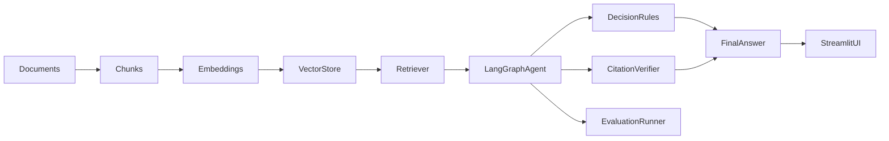

# PolicyOps Agent

## 1. What This Is

PolicyOps Agent is an **agentic RAG system** for workplace policy decisions. It supports two modes in one Streamlit app:

- **Standard RAG Chat** — direct Q&A over public AI governance documents
- **PolicyOps Agent** — scenario-based policy review with structured decisions, citations, memory, and evaluation

The system uses document ingestion, chunking, embeddings, vector retrieval, LangGraph orchestration, deterministic decision rules, citation verification, multi-turn thread memory, and a golden-case evaluation dashboard.

## 2. Why I Built This

Basic RAG demos are common. Enterprise AI reviewers look for more:

- Grounded answers with verifiable citations
- Traceable agent workflows (not black-box chat)
- Structured decisions with risk and confidence
- Multi-turn clarification and memory
- Evaluation before adding complexity
- Clear separation between document Q&A and decision scenarios

This project shows how a policy assistant can evolve from a simple RAG chatbot into an **evaluation-ready agentic decision-support system**.

## 3. Demo Modes

| Mode | Best for | Output |
|------|----------|--------|
| **Standard RAG Chat** | Direct knowledge-base questions | Grounded answer + PDF sources |
| **PolicyOps Agent** | Workplace policy scenarios | Decision, risk, confidence, citations, trace, next steps |

Each mode uses **separate chat threads** so histories never mix.

## 4. Architecture at a Glance

**RAG pipeline:**

```text
Documents → Chunks → Embeddings → Vector Store → Retriever → Answer
```

**Agent pipeline (Phase 3):**

```text
User Scenario → Intent → Hybrid Parser → Memory Merge → Retrieval
→ Missing Info Check → Router → Decision / Clarify / Escalate
→ Citation Verification → Final Answer → Thread Memory
```



## 5. Phase-by-Phase Build

| Phase | What changed | Why it mattered | Key files |
|-------|--------------|-----------------|-----------|
| **0** | Synthetic Acme Corp policies + ingest | Enterprise-style mock corpus (v2.0) | `data/policies/mock/`, `scripts/ingest_mock_policies.py` |

## Synthetic Acme Corp Policy Corpus

The files in `data/policies/mock/` are **fictional** policies for Acme Corp (not a real company). They are designed to simulate the complexity of a large global enterprise for RAG retrieval, policy-rule extraction, and agent evaluation.

They are inspired by public guidance and common enterprise practices (see `data/policies/source_references.md`) but are **original synthetic text** — not legal, HR, finance, tax, or compliance advice.

| Policy | What it covers |
|--------|----------------|
| Approval Matrix | Cross-functional approval routing (AM-001–AM-020) |
| Gifts and Hospitality | Thresholds, cash prohibitions, public officials, procurement blackout (GH-001–GH-025) |
| Travel and Expense | Travel, client meals, lodging, alcohol, upgrades (TE-001–TE-030) |
| Reimbursement | Claims, receipts, missing receipts, late submissions (RE-001–RE-025) |
| Remote Work | Short-term, extended, medical, cross-border remote work (RW-001–RW-030) |
| Data Access | Classification, least privilege, external sharing, AI tools (DA-001–DA-035) |

After editing policy files, re-ingest with:

```bash
python scripts/ingest_mock_policies.py --replace
```
| **1** | Agent foundation, trace, Streamlit Agent Mode | Structured workflow over retrieval | `agent/state.py`, `agent/nodes.py`, `agent/graph.py` |
| **2** | Grounded decision engine, citation verify | Auditable structured decisions | `agent/decision_rules.py`, `agent/citation_verifier.py` |
| **2.5** | Answer quality + UI cleanup | Useful decisions vs over-blocking | `agent/answer_formatter.py`, blocking vs open questions |
| **3** | LangGraph, LLM parsing, memory, evals | Stateful enterprise-grade agent | `agent/langgraph_workflow.py`, `agent/memory.py`, `evals/` |

## 6. Key Technical Concepts

- **RAG** — Retrieve relevant chunks, then generate or reason over them instead of guessing from training data.
- **Chunking** — Split documents into searchable segments with metadata like section IDs.
- **Embeddings** — Convert text into vectors for similarity search.
- **Vector database** — Chroma stores embeddings for fast retrieval.
- **Agent state** — Shared memory for one agent run (facts, decision, citations, trace).
- **LangGraph** — Stateful graph orchestration with conditional routing between nodes.
- **Tool use** — Deterministic functions for parsing, retrieval, missing-info checks, and next steps.
- **Conditional routing** — Route to clarify, decide, or escalate based on blocking info and risk flags.
- **Structured outputs** — Hybrid heuristic + optional LLM parsing into typed scenario fields.
- **Citation verification** — Only cite chunks that were actually retrieved.
- **Memory** — Merge prior scenario facts with follow-up user replies in the same thread.
- **Evals** — Golden cases with transparent metrics for decision and citation quality.
- **Guardrails** — LLM parses scenarios; deterministic rules make final decisions.

## 7. Key Architectural Decisions

- **Synthetic policies** instead of real company data for safe portfolio demos
- **Deterministic rules + LLM-assisted parsing** — LLM does not make the final decision
- **Citations must come from retrieved chunks** — never invented section IDs
- **Blocking vs open questions** — secondary missing details do not always block useful decisions
- **LangGraph** for stateful orchestration and routing
- **Streamlit** for portfolio-friendly UI with separated threads and tabs
- **Eval dashboard** to demonstrate quality thinking before production scale

## 8. How To Run

```bash
git clone https://github.com/sybase91/policy-rag-assistant.git
cd policy-rag-assistant
python3 -m venv .venv
source .venv/bin/activate
pip install -r requirements.txt
cp .env.example .env
# Add your OPENAI_API_KEY to .env

python -m src.embed --rebuild
python scripts/ingest_mock_policies.py --replace
streamlit run app/streamlit_app.py
```

**Agent tests and evals:**

```bash
python -m unittest tests.test_phase2_agent tests.test_phase3_agent -v
python evals/run_agent_evals.py
```

**Optional env flags** (see `.env.example`):

- `USE_LANGGRAPH=true`
- `USE_LLM_PARSER=true`
- `LLM_PARSER_MODEL=gpt-4o-mini`

## 9. Example Questions

**Standard RAG Chat**

- What is prompt injection?
- What are the core functions of the NIST AI RMF?
- What risks are specific to generative AI systems?

**PolicyOps Agent**

- Can I accept an INR 12,000 gift from a vendor?
- Can I reimburse a client dinner for INR 18,000 if two external guests attended and I paid with my own card?
- Can I share customer data with an external vendor for analysis?

**Multi-turn follow-up**

1. Can I accept an INR 12,000 gift from a vendor?
2. It is not cash and no public official is involved.

## 10. Evaluation

Golden cases live in `evals/golden_policy_cases.json` (18 scenarios).

**Metrics:** decision accuracy, risk accuracy, approval match, citation presence, must-cite hit rate, open-question relevance, retrieval hit rate, average confidence, escalation precision.

```bash
python evals/run_agent_evals.py
```

Results are saved to `evals/latest_eval_results.json` and viewable in the Streamlit **Evaluations** tab.

**Interpreting failures:** compare expected vs actual decision/risk in the failed-cases expander. Loosen golden expectations or improve rules/retrieval for recurring misses.

## 11. Known Limitations

- Synthetic Acme Corp policies — not legal, HR, finance, or compliance advice
- LLM parsing may fail and falls back to heuristics
- Thread memory is per browser session (optional JSON persistence via `THREAD_PERSISTENCE`)
- Eval set is small but useful; retrieval is mocked in CI eval runner
- Decision rules are simplified portfolio logic, not production policy engines
- No authentication, multi-user SaaS, or production observability

## 12. Lessons Learned / Pitfalls

- RAG alone is not enough for decision workflows — structure and rules matter
- Missing information should not always block a useful provisional answer
- Citation formatting affects trust as much as retrieval quality
- Memory is essential for clarifying-question follow-ups
- Evals should exist before adding more agent complexity
- UI separation matters when standard chat and agent mode coexist

## 13. Roadmap

- **Phase 4** — Guardrails and human approval workflow
- **Phase 5** — Deployment, monitoring, and analytics
- **Phase 6** — Enterprise integrations (Slack, Teams, Jira, ServiceNow)

---

## Safety Note

- Keep your OpenAI API key only in local `.env`
- Never commit `.env`
- `data/processed/` is gitignored (Chroma database)
- Acme Corp policies are fictional demo content

## Appendix: NIST RAG Baseline

The repo also includes a full NIST/OWASP RAG baseline (ingest, embed, retrieve, generate, evaluate). Use **Standard RAG Chat** in Streamlit or:

```bash
python -m src.generate
python -m src.evaluate
```

See [reports/architecture.md](reports/architecture.md) for technical detail.
