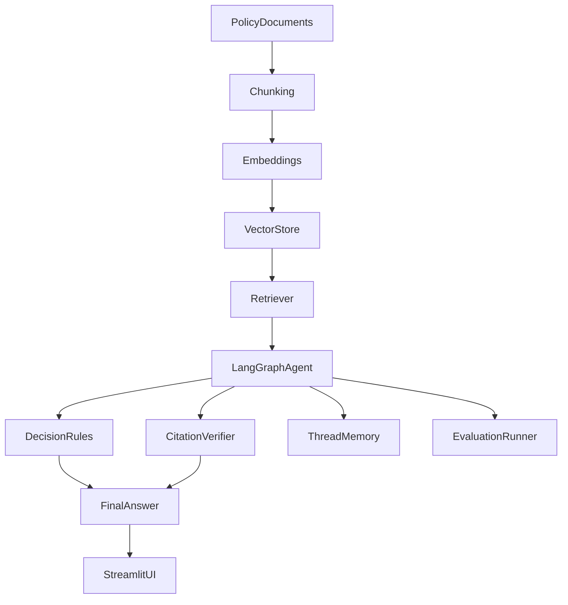
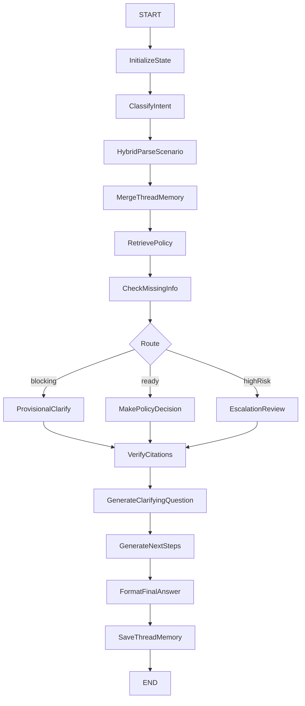

# PolicyOps Agent Architecture

## System Overview

PolicyOps Agent is a dual-mode assistant:

- **Standard RAG Chat** — grounded Q&A over public AI governance PDFs
- **PolicyOps Agent** — LangGraph-orchestrated scenario review over synthetic Acme Corp workplace policies

Both modes share the same Chroma vector store but use separate Streamlit thread stores.

## Component Diagram



## Agent Graph (Phase 3)



**Routing rules (`agent/routing.py`):**

| Route | Condition |
|-------|-----------|
| `escalate` | Public official, cash gift, cross-border work, or sensitive external data sharing |
| `clarify` | Blocking missing information (including no retrieved chunks) |
| `decide` | Otherwise — open questions alone do not block |

## State Schema

Key `AgentState` / `GraphState` fields:

| Field | Purpose |
|-------|---------|
| `user_query` | Current user message |
| `conversation_history` | Prior thread messages |
| `previous_scenario_facts` | Facts from last turn |
| `merged_scenario_facts` | Combined facts after memory merge |
| `parser_mode` | `heuristic`, `hybrid`, or `llm` |
| `router_path` | `decide`, `clarify`, or `escalate` |
| `blocking_missing_info` | Details that prevent a useful decision |
| `open_questions` | Non-blocking follow-up questions |
| `policy_decision` | Allowed / Not allowed / Needs approval / Needs more information / Escalate |
| `verified_citations` | Citations from retrieved chunks only |
| `thread_memory` | Slim snapshot for next turn |
| `trace` | Workflow step log (no chain-of-thought) |

## Decision Layer

Deterministic rules in `agent/decision_rules.py` evaluate scenario facts against Acme mock policy thresholds. The LLM **parses** scenarios (`agent/llm_parser.py`) but does **not** make final decisions.

Priority: Escalate → Not allowed → Needs approval → Allowed → Needs more information (blocking only).

## Memory Layer

`agent/memory.py` supports multi-turn threads:

- `merge_scenario_facts()` combines prior and new facts
- `merge_follow_up_facts()` handles short clarifying replies ("not cash", "no public official")
- Streamlit stores `thread["agent_memory"]` with `last_agent_state` snapshot
- `build_retrieval_query()` enriches follow-up retrieval with merged context

## Evaluation Layer

| Asset | Role |
|-------|------|
| `evals/golden_policy_cases.json` | 18 golden scenarios |
| `evals/eval_metrics.py` | Transparent metric functions |
| `evals/run_agent_evals.py` | CLI runner + `latest_eval_results.json` |
| Streamlit **Evaluations** tab | Button-triggered dashboard |

## RAG Baseline (Phases 1–6)

Public-policy RAG pipeline:

```text
PDFs → ingest/chunk → embed → Chroma → retrieve → generate → Streamlit → evaluate
```

| Stage | Module |
|-------|--------|
| Ingest/chunk | `src/ingest.py`, `src/chunk.py` |
| Embed | `src/embed.py` |
| Retrieve | `src/retrieve.py` |
| Generate | `src/generate.py` |
| Evaluate | `src/evaluate.py`, `evals/gold_questions.csv` |

## PolicyOps Timeline

| Phase | Focus |
|-------|--------|
| 0 | Mock Acme corpus + additive ingest |
| 1 | Linear agent foundation + trace |
| 2 | Grounded decision engine + citation verify |
| 2.5 | Answer quality calibration + compact UI |
| 3 | LangGraph + LLM parsing + memory + eval dashboard |

## Failure Modes

| Failure | Handling |
|---------|----------|
| No relevant retrieval | Blocking missing info → clarify path |
| Low citation coverage | Confidence lowered; may downgrade decision |
| LLM parser failure | Fallback to heuristic parser |
| Conflicting policy signals | Conservative decision + escalation |
| Missing blocking information | Provisional "Needs more information" |
| Overly broad query | General policy evaluator or clarify |

## Configuration

`src/config.py`:

- `USE_LANGGRAPH`, `USE_LLM_PARSER`, `LLM_PARSER_MODEL`, `THREAD_PERSISTENCE`
- `CHROMA_PERSIST_DIR`, `CHAT_MODEL`, `EMBEDDING_MODEL`

## Security Notes

- `.env` is gitignored; only `.env.example` is committed
- OpenAI calls require a local API key
- Synthetic Acme policies are demo-only

## Future Architecture

- Human approval workflows and guardrail service
- Observability (tracing, metrics, alerting)
- Production database for threads and audit logs
- Authentication and multi-user deployment
- Enterprise integrations (Slack, Teams, Jira, ServiceNow)
