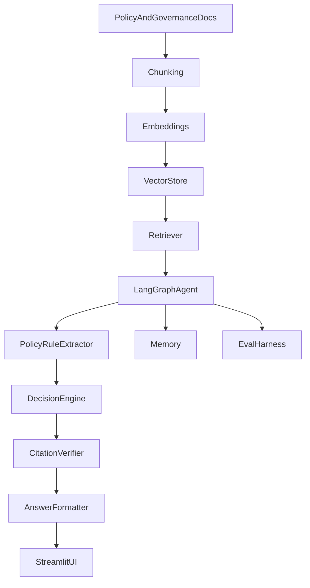
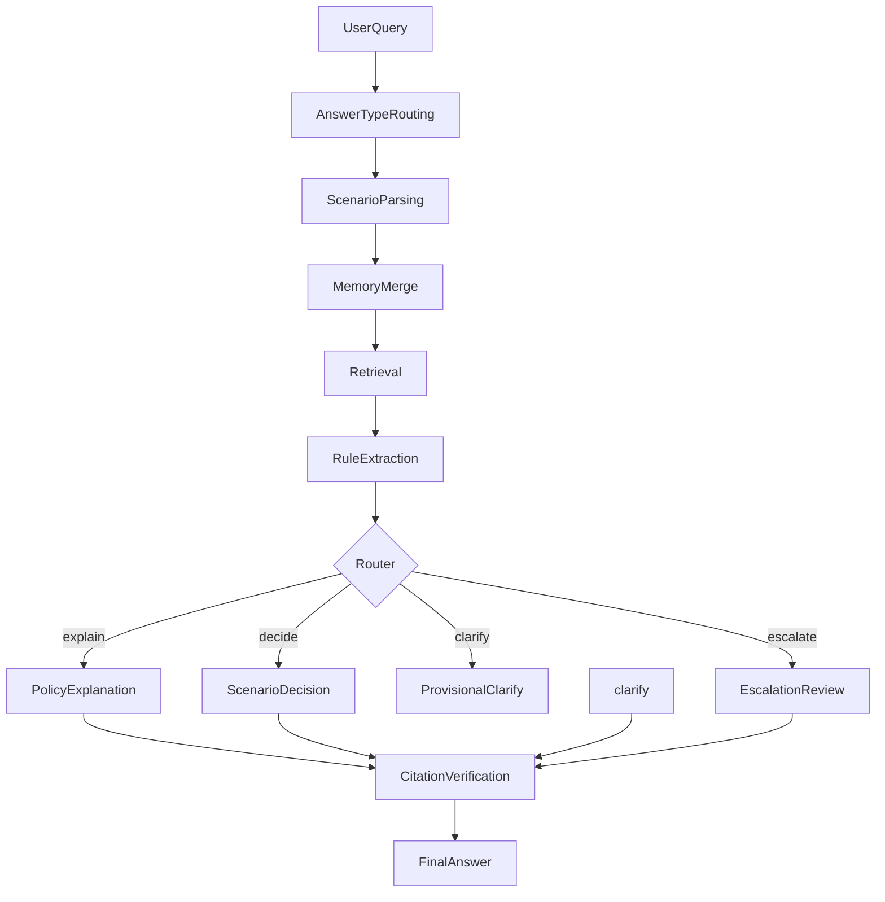
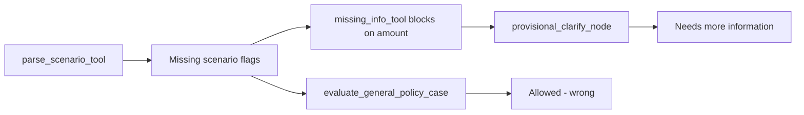

# PolicyOps Agent Architecture

## System Overview

The app has two modes in one Streamlit UI:

1. **Standard RAG Chat** — Q&A over public NIST/OWASP AI governance PDFs (`src/` pipeline).
2. **PolicyOps Agent** — LangGraph workflow over synthetic Acme Corp policies (`agent/` pipeline) with structured decisions, policy basis, citations, and trace.

## High-Level Architecture



## Agent Workflow



## Core Components

| Component | Role |
|-----------|------|
| Ingestion | `scripts/ingest_mock_policies.py` chunks Acme policies by section ID |
| Retriever | `agent/tools.py` similarity search over Chroma |
| LangGraph workflow | `agent/langgraph_workflow.py` orchestrates nodes and routing |
| LLM parser | `agent/llm_parser.py` optional scenario enrichment with heuristic fallback |
| Memory | `agent/memory.py` merges thread facts and follow-up replies |
| Policy rule extractor | `agent/policy_rule_extractor.py` structured rules from chunks |
| Decision engine | `agent/decision_rules.py` deterministic thresholds and approvals |
| Routing | `agent/routing.py` decide vs clarify vs escalate; `can_decide_without_amount()` |
| Scenario parser | `agent/tools.py` heuristic fact extraction + `missing_info_tool` blocking rules |
| Citation verifier | `agent/citation_verifier.py` citations subset of retrieved chunks |
| Answer formatter | `agent/answer_formatter.py` type-specific output (explanation vs decision) |
| Evaluation dashboard | Streamlit Evaluations tab + `evals/` runners |

## State Schema

| Field | Purpose |
|-------|---------|
| `user_query` | Current user message |
| `merged_scenario_facts` | Combined facts after memory merge |
| `answer_type` | `policy_explanation`, `scenario_decision`, etc. |
| `extracted_policy_rules` | Rules parsed from retrieved chunks |
| `policy_basis` | Rules selected for the current answer |
| `policy_decision` | Allowed / Needs approval / Escalate / etc. |
| `verified_citations` | Citations from retrieved chunks only |
| `blocking_missing_info` | Facts that block a provisional decision (amount, gift value, etc.) |
| `open_questions` | Non-blocking follow-up questions |
| `trace` | Workflow step log |

## Phase 4.1 Architecture Learnings

### Failure funnel (pre-4.1)

Most `wrong_decision` failures followed this path:



Retrieval was healthy on live runs; the agent never reached the correct evaluator.

### Fixes by layer

| Layer | File(s) | Change |
|-------|---------|--------|
| Parsing | `agent/tools.py`, `agent/schemas.py` | Tickets, late submission, duplicates, personal expense, finance/HR data, vendor sharing, ChatGPT, personal email, public links; amount-last-wins |
| Missing info | `agent/tools.py` | Amount non-blocking when policy is deterministic (alcohol, duplicate, personal card, etc.) |
| Routing | `agent/routing.py` | Escalate on `data_already_shared`, HR+vendor, public AI+sensitive; decide when amount optional |
| Decision rules | `agent/decision_rules.py` | Scenario branches for reimbursement, gifts, data, travel; narrow general Allowed fallback |
| Standard RAG | `src/generate.py`, `src/retrieve.py` | `retrieve_context_with_scores()` + similarity/topic refusal |
| Eval | `evals/eval_metrics.py`, `evals/eval_helpers.py` | Skip decision check for explanations; fix empty `must_cite_sections` mock bug |

### Escalation triggers (post-4.1)

`route_after_missing_info` escalates before decision when:

- `public_official_involved`, `cash_gift`, `cross_border_work`
- `vendor_contract_renewal`, `active_rfp`
- `data_already_shared`
- `hr data` + `external_vendor_involved`
- `public_ai_tool` + sensitive/customer data
- `personal_channel` + `sensitive_data_involved`
- `sensitive_data_involved` + `external_vendor_involved`

### Standard RAG boundary

Standard RAG (`src/generate.py`) refuses when:

1. Top similarity score &lt; 0.35, or
2. Question mentions out-of-corpus topics (`refund`, `bonus`, `parental leave`) and top chunk is Acme employee-policy content only.

This prevents reimbursement chunks from answering unrelated company-policy questions.

## Failure Modes and Mitigations

| Failure mode | Mitigation | Phase 4.1 status |
|--------------|------------|-------------------|
| Generic answer | Policy rule extraction + section IDs in rationale | Improved; 1 soft case remains |
| Wrong decision | Golden evals + grounded `decision_rules.py` | **Fixed** (13 → 0 on mock) |
| Hallucinated citation | Citation verifier | Stable |
| Memory failure | Thread state + `merge_follow_up_facts` | Stable |
| Prompt injection | Policy-grounded refusal; do not obey user override | Stable |
| Boundary / no policy | Explicit refusal when retrieval empty or topic mismatch | **Fixed** (`rag_refund_policy`) |
| Standard RAG confusion | Separate formatters and runners per mode | **Fixed** |
| Clarify-before-decide | Non-blocking amount + `can_decide_without_amount()` | **Fixed** |
| General Allowed fallback | Route flagged scenarios to correct evaluator | **Fixed** |
| Low grounding | Include must_include concepts in rationale | Soft (9 passing cases) |
| Redundant open question | `filter_redundant_open_questions` | Soft (1 passing case) |

## Quality Audit (Phase 4 / 4.1)

```text
phase4_quality_questions.json (75 cases)
  -> run_phase4_quality_audit.py
  -> phase4_audit_metrics.py (failure-mode scoring)
  -> phase4_quality_results.json + phase4_failure_modes.md
```

### Metrics (Phase 4.1)

| Metric | Pre-4.1 | Post-4.1 (mock) |
|--------|---------|-----------------|
| Phase 4 pass rate | 61/75 (81.3%) | **75/75 (100%)** |
| Golden eval pass rate | 17/20 (85%) | **20/20 (100%)** |
| Dominant failure | `wrong_decision` (13) | `low_grounding` (9, non-blocking) |
| Unit tests | 33 | **48** (+ `test_phase41_fixes.py`) |

Categories: policy explanation, gifts, remote work, travel, reimbursement, data access, multi-turn memory, ambiguity, contradiction, prompt injection, retrieval boundary, Standard RAG.

```bash
python evals/run_phase4_quality_audit.py          # live retrieval (default; needs .env + ingest)
python evals/run_phase4_quality_audit.py --mock   # offline CI; validates routing/rules without API
python evals/run_agent_evals.py                   # golden 20-case regression
python -m unittest tests.test_phase41_fixes -v    # Phase 4.1 targeted tests
```

**Operational note:** Live audit depends on `OPENAI_API_KEY` in `.env` and a populated Chroma index. If all cases return `retrieved_count: 0`, re-run `python scripts/ingest_mock_policies.py --replace`. Mock audit is the reliable gate for decision-logic regressions.

## RAG Baseline

Standard RAG uses `src/retrieve.py` and `src/generate.py` over NIST/OWASP documents. Phase 4.1 added `retrieve_context_with_scores()` and topic/similarity refusal gates so out-of-corpus questions (e.g. refund policy) are not answered from unrelated Acme reimbursement chunks. Legacy v0.1 eval: `src/evaluate.py` -> `reports/evaluation_report.md`.

## Future Architecture

- Human approval workflow and case database
- Audit logs and observability
- Authentication and multi-tenant support
- Enterprise integrations (ticketing, ERP, identity)

## Security Notes

- API keys via environment variables only; never committed.
- Citations restricted to retrieved chunks.
- Synthetic policies only; not production legal or compliance advice.
