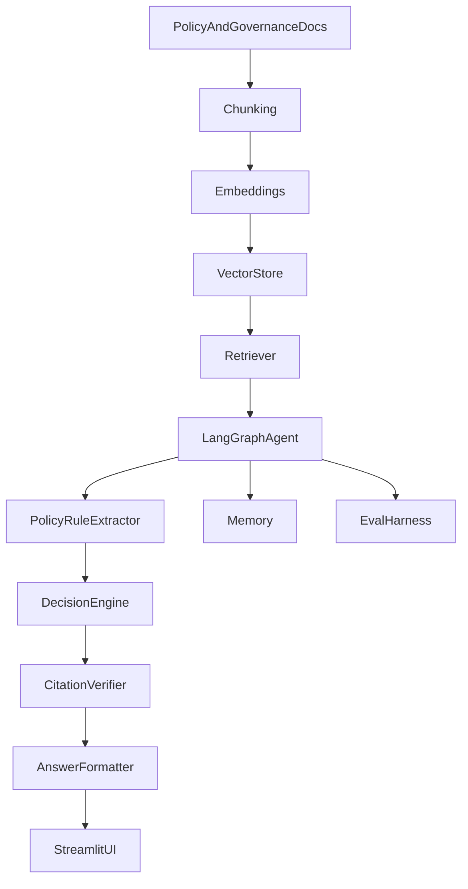
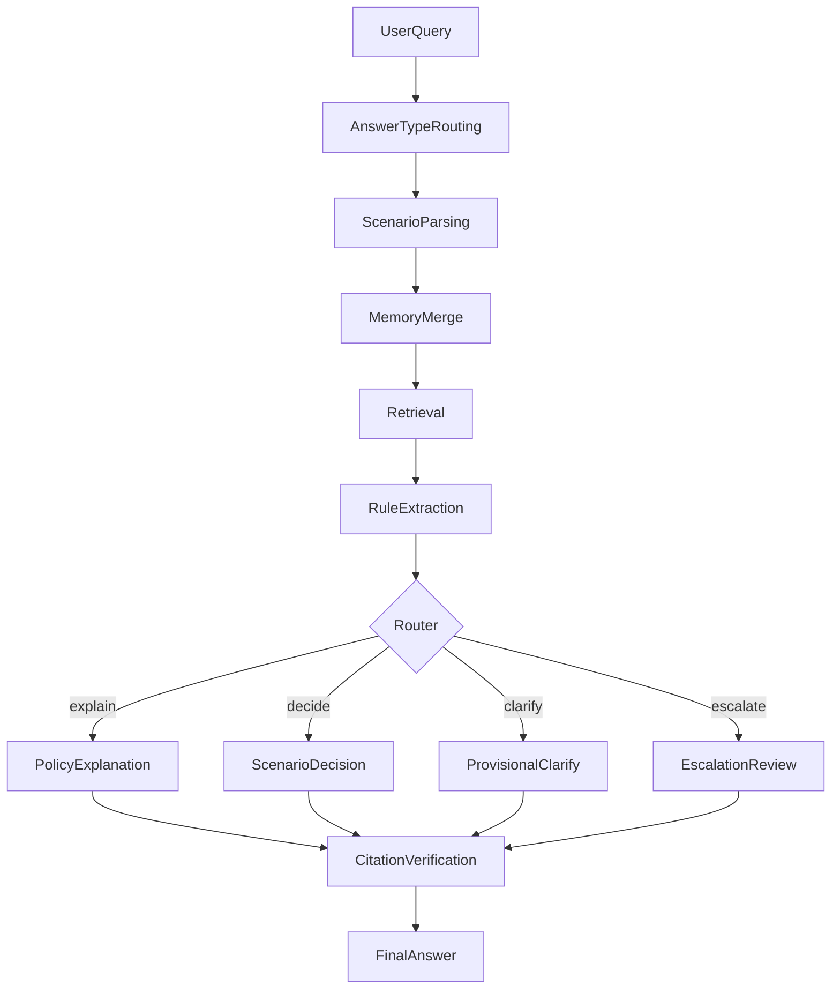

# PolicyOps Agent Architecture

## System Overview

The app has two modes in one Streamlit UI:

1. **Standard RAG Chat** — Q&A over public NIST/OWASP AI governance PDFs (`src/` pipeline).
2. **PolicyOps Agent** — LangGraph workflow over synthetic Acme Corp policies (`agent/` pipeline) with structured decisions, policy basis, citations, and trace.

## High-Level Architecture



## Agent Workflow



## Core Components

| Component | Role |
|-----------|------|
| Ingestion | `scripts/ingest_mock_policies.py` chunks Acme policies by section ID |
| Retriever | `agent/tools.py` similarity search over Chroma |
| LangGraph workflow | `agent/langgraph_workflow.py` orchestrates nodes and routing |
| LLM parser | `agent/llm_parser.py` optional scenario enrichment with heuristic fallback |
| Memory | `agent/memory.py` merges thread facts and follow-up replies |
| Policy rule extractor | `agent/policy_rule_extractor.py` structured rules from chunks |
| Decision engine | `agent/decision_rules.py` deterministic thresholds and approvals |
| Citation verifier | `agent/citation_verifier.py` citations subset of retrieved chunks |
| Answer formatter | `agent/answer_formatter.py` type-specific output (explanation vs decision) |
| Evaluation dashboard | Streamlit Evaluations tab + `evals/` runners |

## State Schema

| Field | Purpose |
|-------|---------|
| `user_query` | Current user message |
| `merged_scenario_facts` | Combined facts after memory merge |
| `answer_type` | `policy_explanation`, `scenario_decision`, etc. |
| `extracted_policy_rules` | Rules parsed from retrieved chunks |
| `policy_basis` | Rules selected for the current answer |
| `policy_decision` | Allowed / Needs approval / Escalate / etc. |
| `verified_citations` | Citations from retrieved chunks only |
| `open_questions` | Non-blocking follow-up questions |
| `trace` | Workflow step log |

## Failure Modes and Mitigations

| Failure mode | Mitigation |
|--------------|------------|
| Generic answer | Policy rule extraction + section IDs in rationale |
| Wrong decision | Golden evals + grounded `decision_rules.py` |
| Hallucinated citation | Citation verifier |
| Memory failure | Thread state + `merge_follow_up_facts` |
| Prompt injection | Policy-grounded refusal; do not obey user override |
| Boundary / no policy | Explicit no-relevant-policy message when retrieval is empty |
| Standard RAG confusion | Separate formatters and runners per mode |

## Quality Audit (Phase 4)

```text
phase4_quality_questions.json (75 cases)
  -> run_phase4_quality_audit.py
  -> phase4_audit_metrics.py (failure-mode scoring)
  -> phase4_quality_results.json + phase4_failure_modes.md
```

Categories: policy explanation, gifts, remote work, travel, reimbursement, data access, multi-turn memory, ambiguity, contradiction, prompt injection, retrieval boundary, Standard RAG.

```bash
python evals/run_phase4_quality_audit.py          # live retrieval (default)
python evals/run_phase4_quality_audit.py --mock   # offline CI
```

Golden regression evals (20 cases) remain in `evals/run_agent_evals.py`.

## RAG Baseline

Standard RAG uses `src/retrieve.py` and `src/generate.py` over NIST/OWASP documents. Legacy v0.1 eval: `src/evaluate.py` -> `reports/evaluation_report.md`.

## Future Architecture

- Human approval workflow and case database
- Audit logs and observability
- Authentication and multi-tenant support
- Enterprise integrations (ticketing, ERP, identity)

## Security Notes

- API keys via environment variables only; never committed.
- Citations restricted to retrieved chunks.
- Synthetic policies only; not production legal or compliance advice.
